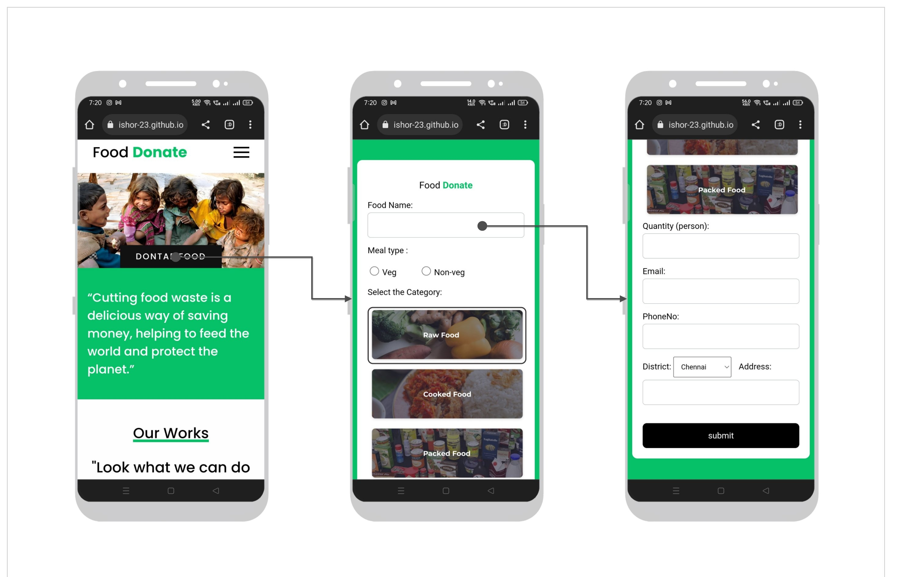

# Food waste management system
<!--  -->

  The basic concept of this project  Food Waste Management is to collect the excess/leftover food from donors such as hotels, restaurants, marriage halls, etc and distribute to the needy people.

<h2>Tools and Technologies</h2> 
<ul>
 <li>Frontend : HTML, CSS, JavaScript</li>
 <li>Backend  : PHP</li>
 <li>Webserver: XAMPP server</li>
 <li>Database: MySQL</li>
</ul>

<h2>The system has three modules:</h2>
<ul>
  <li>User</li>
  <li>Admin</li>
  <li>Delivery</li>
</ul>

The User module is designed for people who wish to donate their excess or leftover food to help reduce food wastage. The module allows users to register, login, and donate food. The system matches donations with the nearest needy organizations.

The Administrator module is for trusts, NGOs, and charities. Admins manage the food donation process, track requests, and assign deliveries to delivery personnel.

The Delivery Person module allows individuals to register as delivery agents. They handle the pickup and delivery of donated food.

Overall, the Food Waste Management System helps reduce food waste and ensures efficient distribution to those in need.

<h3>User</h3>

<h3>Admin</h3>

<h3>Delivery</h3>

<h3>Features:</h3>
<ul>
  <li>Mobile Screen Friendly Website</li>
  <li>Chatbot Support</li>
  <li>Secure Login</li>
</ul>

<h2>Mobile Screen Friendly Website</h2>

<h2>Chatbot Support</h2>

<h2>Secure Login</h2>

<h2>How to Run</h2>
<ol>
 <li>Download the project zip file</li>
 <li>Extract and copy the folder</li>
 <li>Paste it inside the root directory (xampp/htdocs)</li>
 <li>Open PHPMyAdmin (http://localhost/phpmyadmin)</li>
 <li>Create a database</li>
 <li>Import <code>demo.sql</code> (inside database folder)</li>
 <li>Run the script: <code>http://localhost/folderName</code></li>
</ol>

<h2>View Project:</h2>
<a href="https://kishor-23.github.io/food-donate/index.html">View Demo</a>
